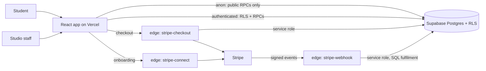
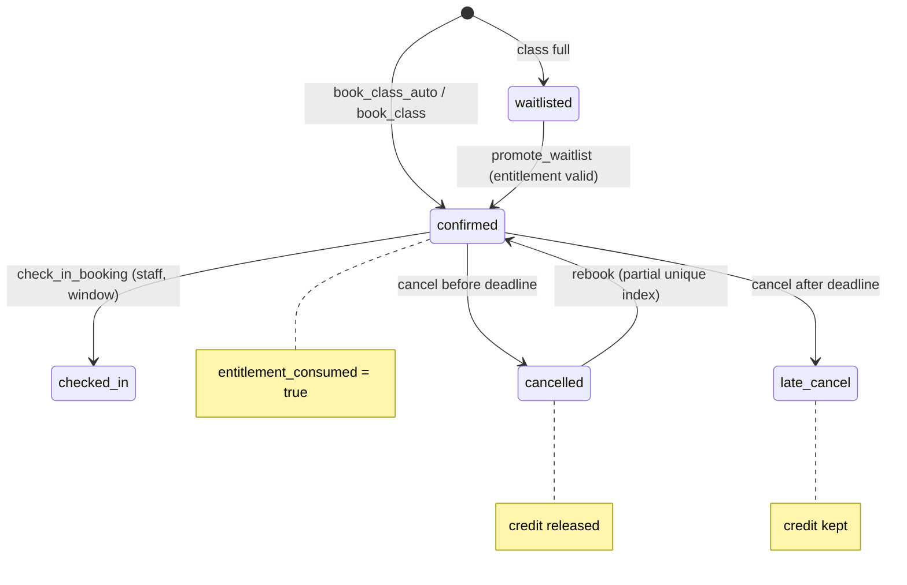
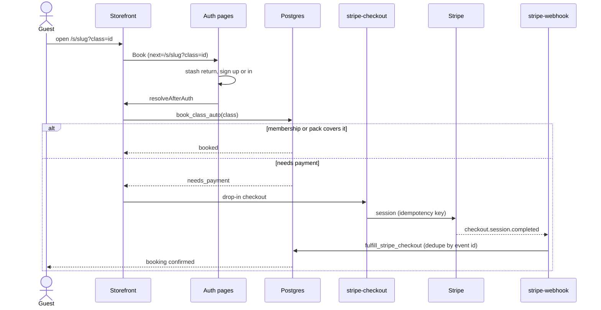
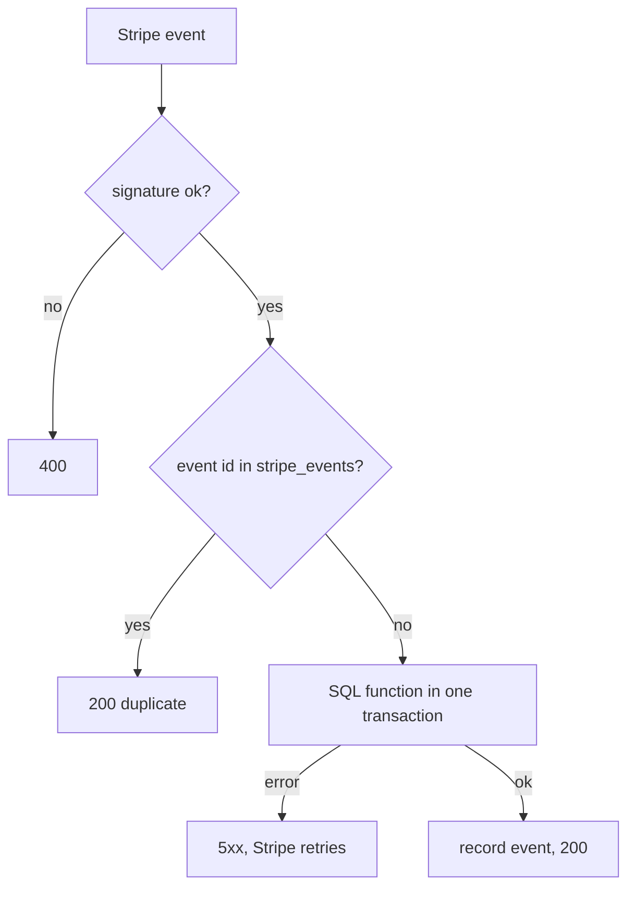
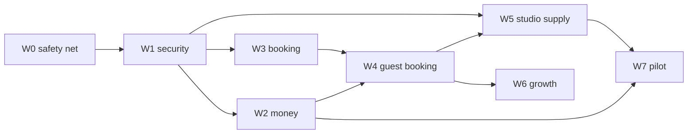

# Launch architecture (v1)

Diagrams for the booking, payment and security model built for launch. Rationale lives in the [PRD](../plans/PRD-launch-v1.md); task order in the [backlog](../plans/BACKLOG.md). Complements [02-architecture](02-architecture.md) and [03-key-flows](03-key-flows.md).

## 1. System context

Anon reads go through `get_public_schedule`, `get_studio_storefront`, `discover_classes`. No table is readable by anon.

## 2. Booking state machine and entitlement ledger

One trigger (`bookings_entitlement_sync`) owns consume and release. Lock order: occurrence, booking, pack or membership.

## 3. Guest to booked

## 4. Webhook idempotency

## 5. Wave dependencies

## 6. RLS policy classes (migration 00023)

| Class | Pattern | Example tables |
|---|---|---|
| A studio config | staff read, owner/admin write | nudge_rules, referral_programs |
| B member activity | member reads own, staff read, server writes | promo_redemptions, engagement_events |
| C child of parent | tenant reached via parent row | purchase_order_items, sms_messages |
| D household and queue | member own, staff read | households, waitlist_promotions |
| E event detail | staff read, admin write, public via RPC | event_sessions |
| F restricted | admin only or the two parties | shift_trades, corporate_employees |

Conventions: `(SELECT auth.uid())`, staff via `my_staff_studio_ids()` / `my_admin_studio_ids()`, every definer function pins `search_path` and revokes from PUBLIC and anon.
